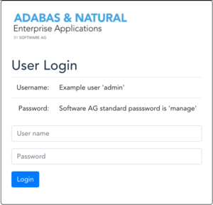
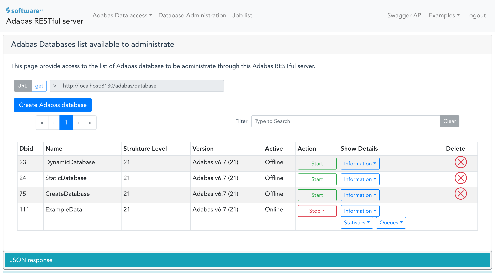
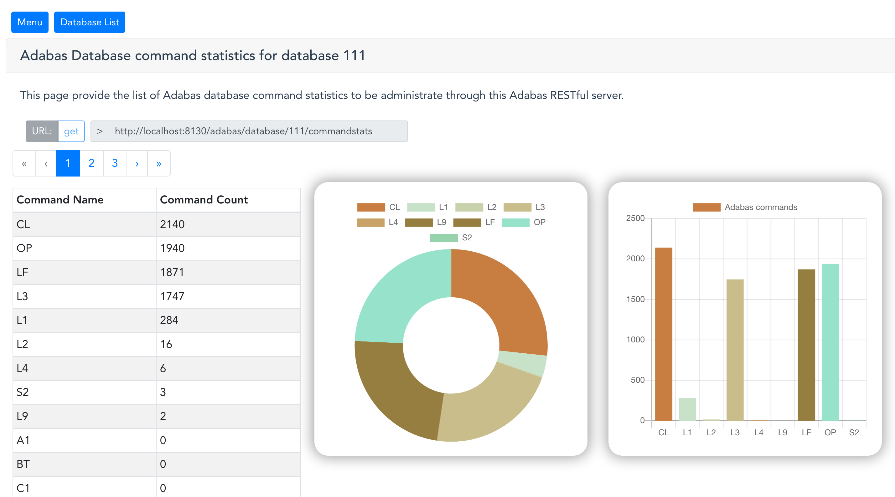
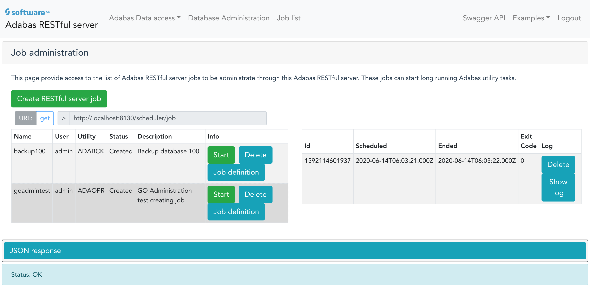

# Adabas REST server WebApp

## Introduction

This Web-Application provides access to all Adabas REST server tasks and data.
All pages contain REST api web URL's used to retrieve the JSON content. The received data is displayed on the web page. Actions are added to the web page as well.



## Installation

The Adabas REST WebApp can be compiled using the NPM and Node infrastructure. NPM third party packages needed to be installed first. Following command will install the corresponding packages in `node_modules`:

```sh
npm install
```

To final compile the web application the distribution need to be build using following command:

```sh
npm run build
```

The final Web-Application is located in the `dist` directory.

## Usage

The example consists out of three parts

1. the web application provides access to Adabas data. The Adabas data access can use the Adabas Map long name which maps classic database reference to long name representation. Alternatively the usage of classic database id and short name reference can be used as well.
2. Adabas administration tasks and monitoring access is possible. The creation of Adabas databases and maintaining Adabas parameters and resources are possible. Various monitor data can be requested.
3. the Adabas REST server provides the start of jobs inside the installation of Adabas. The scripts defined inside the job list.

Beside the main topics above a number of short data-access example pages are included in the Web application. Large objects or Unicode access to the Adabas database are contained in the Web application.

Nearly all pages provide the URL query call and the JSON response output in the corresponding `JSON response` tab.

A menu entry provides the Swagger API of Adabas REST server which can be used to get an overview of available Adabas REST operations.

### Adabas data access

Inside the `Adabas Data access` menu you can access the Adabas example page using Adabas Map references. The Adabas Map administration is done using the `Adabas Client for Java` product delivered by Software AG. The Software AG Adabas Data Designer manage creation, import from various import formats and other administration of Adabas Maps.

The Data access web page contains a number of search parameters like search query, descriptor read or sort criteria.

In addition the Adabas classic way to access Adabas data is provided as well. In the classic Adabas data access you need to define the Adabas database id and the Adabas file. The corresponding field list and possible descriptors are selectable. Press `Query Data` to request the record result.

To get a deep insight into the Adabas Map metadata it can be evaluated using the `Adabas Map Metadata` entry.

Adabas data records can be modified using the `Modify record` page.

### Adabas administration and monitoring

Inside the `Database administration` menu entry the corresponding list of Adabas databases can be viewed. It is possible to administrate and monitor various operation on the database. Dependent on the online state some actions are invisible.



The start and stop of the Adabas databases is initiated in background. Please have a look into the Adabas nucleus log to see the current state. The Adabas databases have a number of tasks which are displayed using the corresponding menues.

Various different monitor tasks are updated periodically. Start and stop operations are called directly.

**Please keep in mind, that delete operations and modifications are done on Adabas databases!!!!!**

#### Monitoring

Various Adabas monitoring data can be retrieved. The number of table entries is not cached or optimized. A huge number of queue entries might take influences on the web application performance.




### Job control

To start and display jobs the `Job list` menu entry can be used.



Job modifications are not added to the web application example.

## Summary

The example pages don't use all REST API possibilities. Some new or enhanced features are not available. Even queue modifications, like stop or delete user queue entries are not possible. To see the full user queue information is not part of the web application example.

**But pay attention. Adabas file delete or refresh operations are part of the web application**

Have fun and stay healthy!

______________________
These tools are provided as-is and without warranty or support. They do not constitute part of the Software AG product suite. Users are free to use, fork and modify them, subject to the license agreement. While Software AG welcomes contributions, we cannot guarantee to include every contribution in the master project.
______________
For more information you can Ask a Question in the [TECHcommunity Forums](https://tech.forums.softwareag.com/tag/adabas).

You can find additional information in the [Software AG TECHcommunity](http://techcommunity.softwareag.com/home/-/product/name/adabas).
______________
Contact us at [TECHcommunity](mailto:technologycommunity@softwareag.com?subject=Github/SoftwareAG) if you have any questions.
